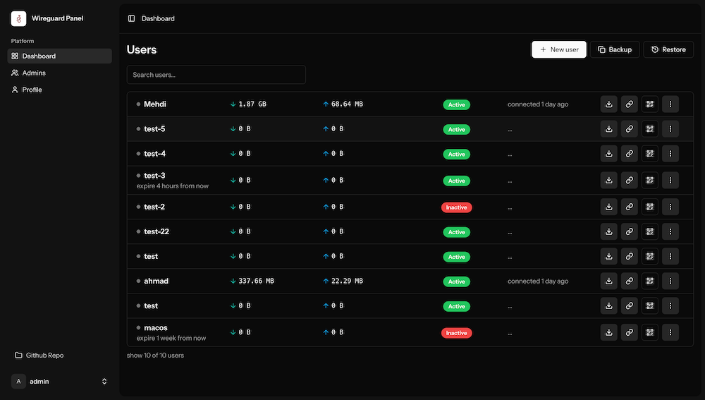

## Wireguard Panel

Simple Wireguard dashboard to create, monitor and manage users.


### To Install Run

```shell
bash <(curl -Ls https://raw.githubusercontent.com/wireguard-panel/wireguard-panel/refs/heads/main/install.sh)
```


### To Upgrade Run

```shell
bash <(curl -Ls https://raw.githubusercontent.com/wireguard-panel/wireguard-panel/refs/heads/main/upgrade.sh)
```


---

### Screenshot


